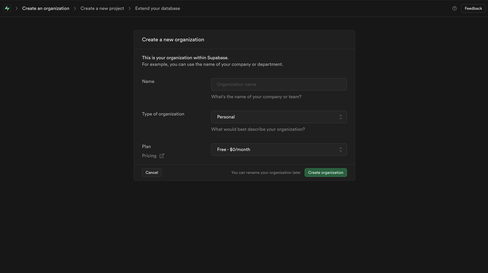
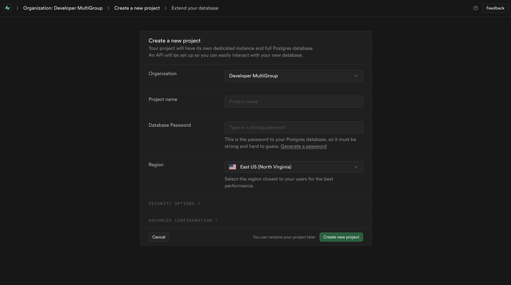
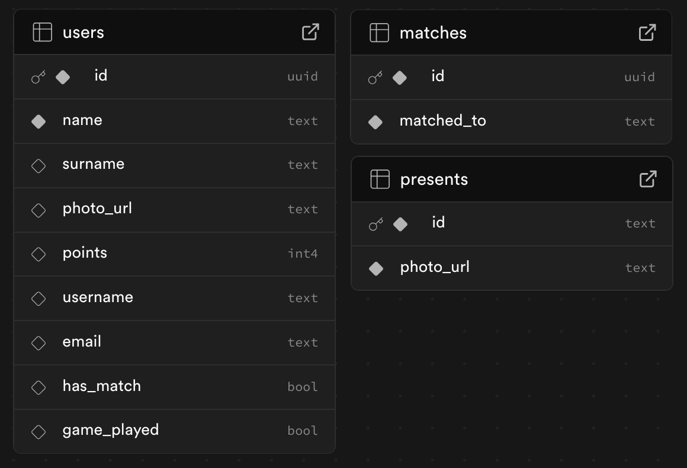
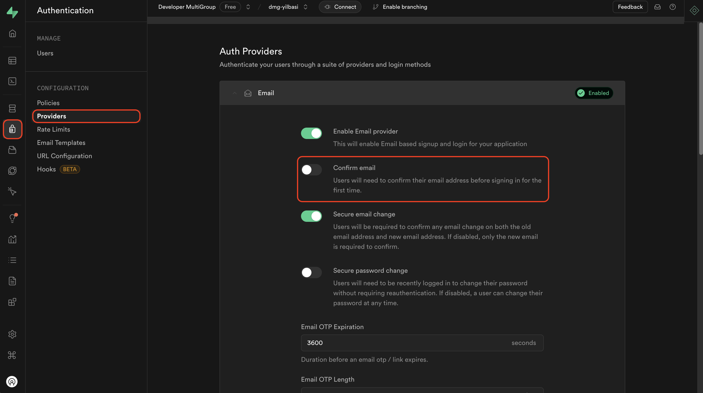
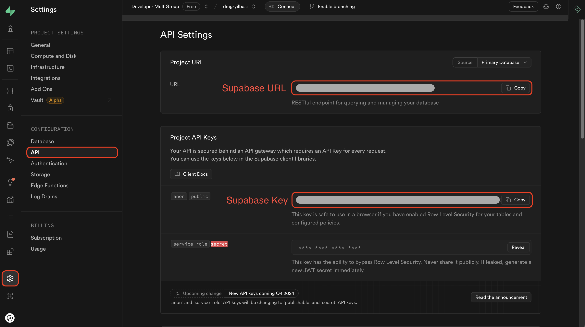

# DMG Çekiliş Arkadaşın

Developer MultiGroup Çekiliş Arkadaşın is a project developed to use in giveaways of any kind. Users log in and choose the person they are going to buy a present to using a giveaway spinner. After that users upload the presents they have bought and play a game of "Who bought this present?" as the last step.

## Technologies

- Next.js: Used for both frontend and backend development of the site.
- Vercel: For deployment of the project to the web.
- Supabase: Preference of provider for user authentication and database management.
- Tailwind CSS: Utility-first CSS framework for responsive and customizable UI.

## Gallery

## Run Locally

### Getting Started

### Supabase Integration

We are using Supabase as our main storage - database - authentication provider for this project, so you firstly should [create an account](https://supabase.com/dashboard/sign-up)

#### Project Creation

As a first step we need to create an organization which will hold our project



and a project which will hold your data (storage - db - auth),



#### Database Creation

Now you are ready to create the tables that will hold your user data, matches and present photo URL's. Here is the schema for the database tables:



To create these tables, you can directly copy and paste the following query to SQL Editor which can be found in your sidebar:

```postgresql
-- Hold the user related calues
create table users (
    id uuid primary key default uuid_generate_v4(), -- Current User ID
    name text, -- Name of the current user
    surname text, -- Surname of the current user
    photo_url text, -- Public URL to users profile picture
    points int4, -- Points gained from the game stage
    username text, -- Username of the current user
    email text, -- E-Mail of the current user
    has_match bool, -- Whether someone has this user as a match in the mathces table
    game_played bool -- Whether the user has played the game already
);

-- Matches tablosu
create table matches (
    id uuid primary key default uuid_generate_v4(), -- Current User ID
    matched_to text -- ID of the matched user
);

-- Presents tablosu
create table presents (
    id text primary key, -- Current User ID
    photo_url text -- Public URL to the photo of the present this user has bought
);
```

#### Storage Creation

Supabase Storage will hold our user's profile pictures and the photos of the presents they have bought, so we need to initialize a storage bucket named `images` and some sub-folders inside that storage bucket with names `presents` and `users`. You can access storage bucket creation in your sidebar's

```sh
📂 images /
├── 📂 presents/
└── 📂 users/
```

It is enough for you to create the directories correctly, the application will handle the rest of the work.

#### Disable Authentication E-Mails

If you don't want your recently registered users to get an automatic e-mail from Supabase Auth for E-Mail verification, you can toggle the following setting in the Authentication tab of your sidebar:



### Environment Variables

You only need two environment variables to run the project correctly, your Supabase URL and Supabase Key. You can get this values from the following page:



After getting these values, (assuming you already forked and cloned this project to your local machine, if not check out [run the project section](#run-the-project) create a `.env` file at the root of your project and populate it like the following:

```env
NEXT_PUBLIC_SUPABASE_URL=your_supabase_url
NEXT_PUBLIC_SUPABASE_KEY=your_supabase_key
```

### Run the Project

1. **Clone the Repository**: Clone the repository to your local machine.
   ```bash
   git clone https://github.com/your-username/repository-name.git
   cd repository-name
   ```

2. **Install Dependencies**: Install the required dependencies.
   ```bash
   npm install
   ```

3. **Start the Development Server**: Run the project in development mode.
   ```bash
   npm run dev
   ```

## Customizing

## Contributing

We are open for any kind contribution you are interested in, follow these steps to help us:

### 1. Fork & Clone

Fork this repository to your account and clone it to your local machine with the following command:

```bash
git clone https://github.com/yourusername/project-name.git
cd project-name
```

### 2. Create Branch
```bash
git checkout -b feature/your-feature
# or
git checkout -b fix/bug-name
```

### 3. Make Changes
Code your features/fixes and have fun :)

### 4. Check Status
```sh
git status
This shows your changed files
```

### 5. Stage Changes
```sh
# Stage all changes
git add . 
# or stage for specific files
git add filename.js
```

### 6. Commit
```sh
git commit -m "Add: new login page"
or
git commit -m "Fix: navigation bar responsiveness"
```

### 7. Push
```sh
git push origin feature/your-feature
```

### 8. Create PR
Go to GitHub and create a Pull Request to this repository

## Contributors

[](https://github.com/Developer-MultiGroup/cekilis-arkadasi)

[](https://star-history.com/#Developer-MultiGroup/cekilis-arkadasi)
